<div align="center">

# Vulnerability Hunter for Next.js

**Runs on the Claude subscription you already pay for. Reports only what it watched happen.**

[](https://github.com/tanguychenier/vulnerability-hunter-next/actions/workflows/ci.yml)
[](https://www.npmjs.com/package/vulnerability-hunter-next)
[](LICENSE)
[](package.json)
[](https://sarifweb.azurewebsites.net/)

</div>

<div align="center">
  
</div>

## Three things this does differently

**It costs nothing per run.** The hunt goes through the `claude` CLI you are
already signed in to. No API key, no per-token bill, no cost to discover
afterwards. Bring a key only for CI, where nobody is signed in.

**It reports what it watched happen.** Every suspicion becomes one HTTP request
sent to your running application. What reproduced is reported with the request,
so you can replay it in a terminal. What did not is dropped before you see it —
not filtered by a confidence threshold you had to tune, just absent.

**You choose the rules, and you can add your own.** 43 ship for Next.js. A
`vulnerability-hunter.config.mjs` at your project root narrows them, mutes one,
or adds a class of flaw nobody shipped yet. The selection is spent on the prompt,
not on the report: rules you removed never cost a token.

## Quick start

```bash
npm install --save-dev vulnerability-hunter-next

# See what would be hunted, and what it would cost. Nothing is sent.
npx vulnhunt . --dry-run

# Hunt against your running dev server. No key needed.
npx vulnhunt . --target http://localhost:3000
```

The map comes out first, and it is meant to be checked against the app you know
you have:

```
4 attack-surface entries found.
43 rules selected.
8 model calls, about 12,110 input tokens.
Estimated cost: 0.15 EUR. Nothing was sent.

  route-handler  app/api/invoices/[id]/route.ts
                 DELETE|GET /api/invoices/[id]
  server-action  app/dashboard/actions.ts
                 actions updateEmail
  page           app/dashboard/page.tsx
                 ANY /dashboard
  middleware     middleware.ts
                 guards /dashboard/:path*
```

## Choosing the rules

```js
// vulnerability-hunter.config.mjs, at the root of your project

export default {
  // Hunt these and nothing else.
  only: ['missing-authorization', 'server-action-without-authorization', 'ssrf'],
  // Mute one without listing all the others.
  without: ['missing-rate-limiting'],
  // Add a class of flaw nobody shipped. Instructions are optional: the model
  // already knows most of them by name.
  with: { 'prompt-injection': 'User text must never reach the system prompt raw.' },
}
```

New classes of attack are named constantly, so a catalogue you cannot extend is
a catalogue that ages between releases.

## What it hunts that only Next.js has

A Server Action is a POST endpoint that looks like a function call, so anyone can
call it and the button in your page is not a guard. A Client Component ships its
whole content to the browser, so an environment value read there travels with
it. A middleware matcher is a guard that is easy to write and easy to leave a
hole in, and authorization enforced there alone leaves every missed path open.

Those three shapes are why a generic scanner misses the flaws that matter here:

| Rule | What it means |
| --- | --- |
| `server-action-without-authorization` | An action that never checks the session. It is a POST endpoint, not a private function. |
| `server-secret-reaching-the-client` | An environment value read in a Client Component, or passed down as a prop. |
| `secret-in-public-env` | A secret in a `NEXT_PUBLIC_` variable, which is inlined into the bundle by design. |
| `bypassable-middleware` | A matcher whose pattern leaves uncovered a path it was written to guard. |
| `middleware-only-authorization` | Authorization in middleware alone, so the handler itself trusts everything. |
| `over-fetching-in-server-component` | Whole records selected and passed to the client, so unused private fields travel with the page. |
| `unsafe-revalidation` | A revalidate or purge endpoint reachable without a secret. |
| `image-optimizer-abuse` | An image domain allowlist wide enough to turn the optimizer into an open proxy. |

The full 43 with their instructions are in
[`src/domain/rules/rule.ts`](src/domain/rules/rule.ts) — one line each, readable
in a minute.

## What a report looks like

```
Scanned 4 attack-surface entries.

HIGH  Invoice readable without a session
  app/api/invoices/[id]/route.ts:4
  params.id reaches the database with no ownership check.
  proof     GET http://localhost:3000/api/invoices/1
  expected  responds 401 or 403 without a session
  observed  200 OK, 214 bytes

1 proven, 2 discarded after their proof did not reproduce.
```

The discarded count is printed even when it is large, and especially then: it is
the only honest signal you have about the model behind the tool.

## Passing again

The same code does not always give the same answer. Measured on a live run of the
sibling tool: one pass over a handler with no authorization check reported a
clean file, and the next reported two flaws.

So the hunt passes again until two passes in a row bring nothing new. That is
affordable precisely because there is no bill per token — the missing recall is
paid in seconds. With `ANTHROPIC_API_KEY` set, it passes once, because then a
second pass is a second bill.

## In CI

```yaml
- uses: tanguychenier/vulnerability-hunter-next@main
  with:
    api-key: ${{ secrets.ANTHROPIC_API_KEY }}
    target: http://localhost:3000
    sarif-file: hunt.sarif

- uses: github/codeql-action/upload-sarif@v3
  with:
    sarif_file: hunt.sarif
```

Findings land in the **Security** tab and annotate the pull request diff, each
one carrying the request that proved it. The build fails on `exit 1` only when
something was proven; a suspicion never fails a build.

## Options

| Flag | Default | |
| --- | --- | --- |
| `--target <url>` | `http://localhost:3000` | Running application used to prove findings. |
| `--format <fmt>` | `console` | `console`, `sarif` or `json`. |
| `--out <file>` | stdout | Write the report to a file. |
| `--model <name>` | `sonnet` | Model to hunt with. |
| `--dry-run` | off | Map the surface, price the hunt, call nothing. |

Exit codes: `0` nothing proven · `1` at least one proven finding · `2` the hunt
could not run. An empty surface is `2`, not `0`: a run that read nothing is not a
clean bill of health.

## What it does not do

- **It does not replace dependency scanning.** Dependabot and Snyk read your
  lockfile, this reads your code. They pair well.
- **It does not find every flaw.** It finds what one HTTP request against a
  running application can demonstrate. A race condition spread over three
  requests is out of reach, and the tool says so rather than guessing.
- **It does not hunt a production deployment.** Point it at a development server
  with disposable data. It sends requests designed to succeed.

## Contributing

```bash
npm install
npm run typecheck
npm test          # no network, no API key
npm run build
```

The architecture is hexagonal on purpose. `src/domain` knows nothing about HTTP,
Next.js or any model vendor; `src/application/ports` names the questions;
`src/infrastructure` answers them. Adding a framework means writing one
`ProjectReader`; adding a model vendor means writing one `ModelGateway`.
`tests/unit/architecture.test.ts` fails the build the moment a layer reaches
outwards, so the rule is enforced rather than described.

Issues and pull requests are welcome, especially real applications where the
surface mapper gets it wrong.

## Licence

MIT © [Tanguy Chénier](https://github.com/tanguychenier)
